# General Topics

# 1.1 Introduction

Siemens product development has developed a standardised package solution. The aims of this project are o:

• Create a product that is structured to fit varied markets through the use of pre engineered options Reduce package purchase cost Reduce the manufacturing time and costs   
• Reduce installation and maintenance time and cost   
• Reduce product structure to a level where it is maintainable   
• Create a set of standard documentation.

This specification gives the technical requirements concerning procurement of the acoustic package. The package has two configurations:

Based around the requirements for an onshore application • For offshore applications.

This specification covers the technical aspects of the package. For a complete set of options, supplier drawing numbers and any supplier specific detail please refer to the supplier specific specification.

The bidder shall conform to this technical specification and its attachments and, in detail, state any points of divergence.

If any component or unit that is not mentioned in this specification can be considered to form an essential part of the equipment of delivery, it must still be included in the scope of supply. The delivery shall include all necessary equipment to form a complete and functional unit.

The Package covered by these requirements is defined by its function rather than design type. Thus the specification is stated in performance terms rather than being specified by detailed description of the Acoustic Package to be supplied.

# 1.2 Description of the Main Scope of Supply

The acoustic package scope consists of

a) Acoustic enclosure and support steelwork where necessary.   
b) Ventilation system including fan(s), silencer, ventilation dampers, filter where required and duct work.   
c) Combustion intake system including filtration, silencer and ductwork d) Exhaust system including silencer, duct work and expansion joint where required.   
e) L.O cooler pipework, breather pipework and P2 pipe work external to enclosure.   
f) Cable tray and small bore pipework above the enclosure roof.

# 1.3 General Split of supply

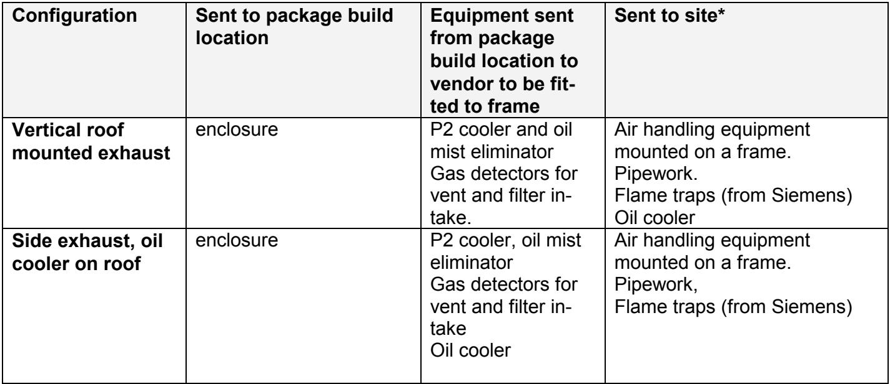

\*Or Siemens works when combined test is required

This specification should be read in conjunction with SGT-100-2S N package acoustic equipment parameter drawing RU01042A.

# References and Design Codes

a) The design shall comply with all applicable International and European Standards. The supplier shall define what standards are applicable.

b) The supplier shall use their expertise to ensure that the developed standards cater for local legislation where possible. In instances where the standards are not suitable for local legislation, the supplier must consider pre-definition of how standards will be adapted to suit, and the implications thereof.

d) All technical data, calculations and measurements shall be presented in SI-units.

# General design requirements and design data

# 3.1 Environmental design limits

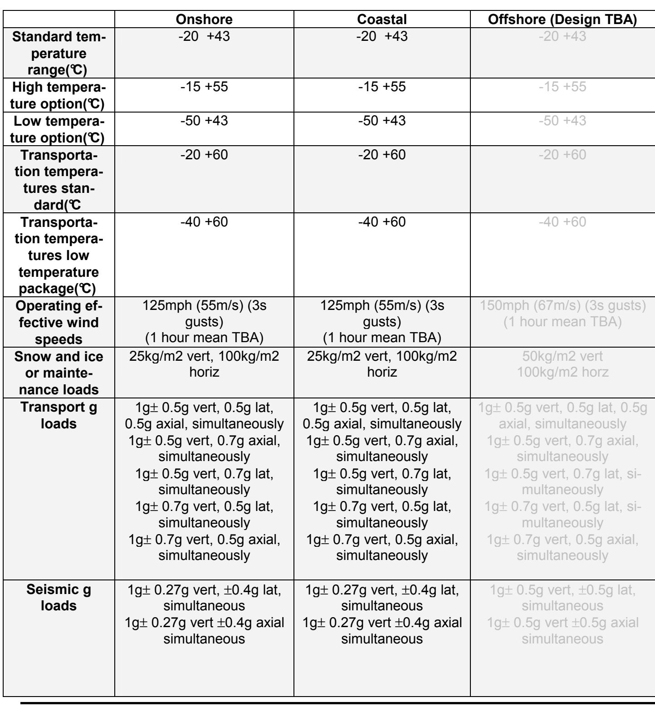
Siemens Industrial Turbomachinery Department E O GT R&D Ref.-No.: 64/03020193   
Issue 05 Page 8 of 49 Date:12-12-2014

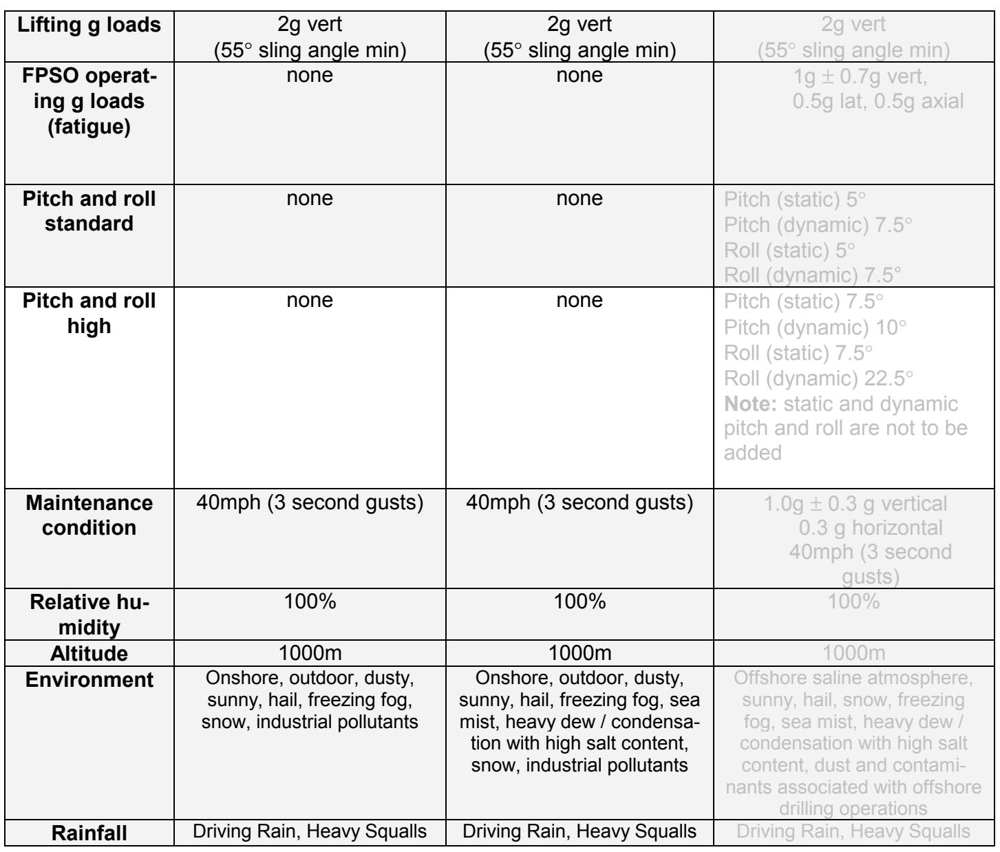

# 3.2 Load combinations

The running loads are analysed with the following combinations:

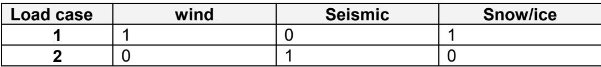

All other loads shall be treated individually.

Issue 05   
Page 9 of 49   
Date:12-12-2014

# 3.3 Noise requirements

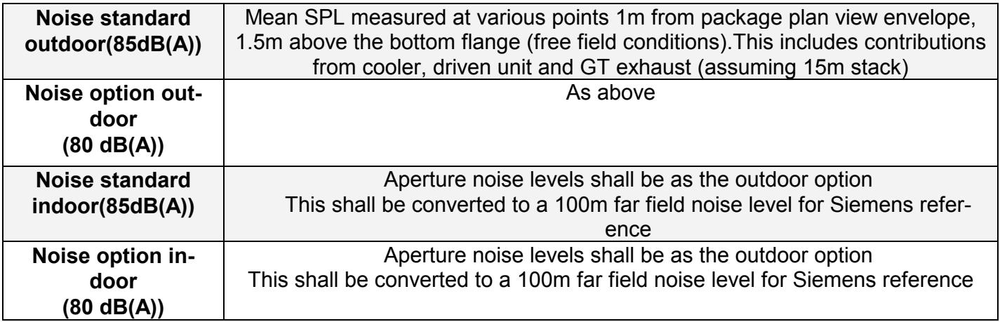

# 3.4 Availability and Reliability

a) The equipment shall be designed for continuous operation   
b) The equipment shall be designed to operate without operator handling during normal operation. A guideline for local supervision by rounding is one time per working shift.

The vendor shall state MTBF figures for:

• Vent dampers • Vent fan • Pulse filter system • Any other critical items

# 3.5 Life expectancy

The Plant is designed for 20 years operation. The bidder shall define limitations on equipment life, if any, and these should be included in the tender evaluation process.

# 3.6 Performance Guarantees

The Bidder shall guarantee the following performance requirements:

Noise level according to chapter 3.4.6 • Filtration requirements as per intake system section. • Life of exhaust flexible joint (when supplied)

Siemens Industrial Turbomachinery Department E O GT R&D Ref.-No.: 64/03020193

# 3.7 Fluids specification

See fluids specification 65/0027. This gives details of combustion and instrument air quality requirements.

# 3.8 Heat release

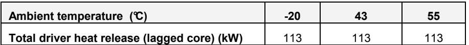

Note: The figures given in this table have been increased from 73kW following measurements during a combined test validation. The above increased heat release values are formally specified for all projects from NU0415/01-02 onwards (previous projects managed on a contract-specific basis).

# 3.9 Enclosure pressures

a) Nominal positive pressure in enclosure due to fan operating: +30mmH2O (±5mmH2O)   
b) Max design over pressure in enclosure: +100mmH2O   
c) Max design under pressure in enclosure: -100mmH2O

# 3.10 Zone in and around package

a) Inside the enclosure is considered a zone 2 area while the fans are running. If ventilation fails and gas is still present on skid the enclosure becomes a zone 1 area.   
b) Positive pressure set: 0.760m loci from enclosure wall zone 2 while fans running   
c) Negative pressure set: Safe area outside enclosure while fans running   
d) See TDR 04/247 for more information

# 3.11 Enclosure design temperatures

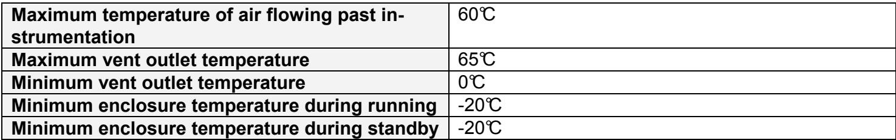

# 3.12 Noise data

The figures quoted as sound power levels (SWL) Ref. 10-12 Watt, dB are calculated from in-duct sound pressure level measurements .

The inlet noise figures, are measured in the middle of the inlet duct approximately 1m above the inlet cas ing, using a condenser microphone fitted with an aerodynamic nose cone.

The exhaust noise figures, are measured in the middle of a vertically orientated radial exhaust duct approximately 1m above the collector, using a calibrated hot gas sound level probe system.

The turbine casing noise levels are quoted as sound pressure levels (SPL) Ref. 2 x 10-5 N/m2, dB. These were measured at 1m from the turbine skid edge of an unenclosed set and at a height level with the core engine centre line, using a condenser microphone and wind shield.

All noise data is subject to a tolerance of ±2dB.

# a) GT Turbine casing noise

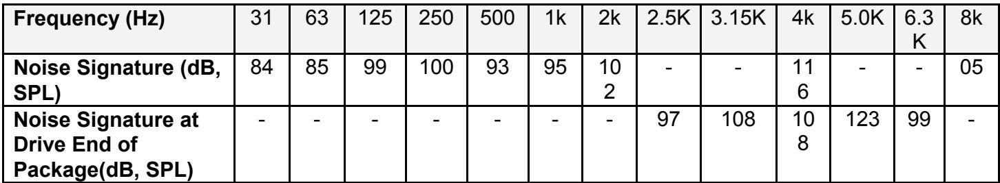
(based upon gas fuel DLE unit measurements) Figures given above are for all levels of power output.

# b) GT Air inlet noise

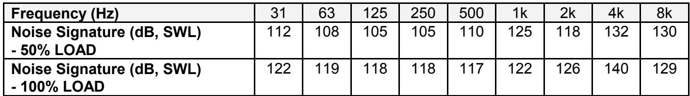

# c) GT exhaust noise

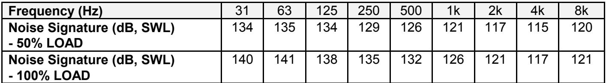
(based upon gas fuel DLE unit measurements)

Siemens Industrial Turbomachinery Department E O GT R&D Ref.-No.: 64/03020193

Issue 05   
Page 12 of 49   
Date:12-12-2014

# d) Standard air blast lube oil cooler for gen set noise (RH5 size – may be reduced to RH4 in detail design stage)

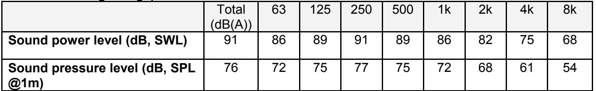

# 3.13 Engine mass flows and temperature

The gas turbine mass flow data quoted is subject to a +/- 3% tolerance. The exhaust temperatures are subject to a tolerance of ±15oC

a) Inlet mass flows

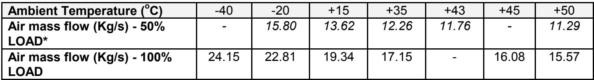

# b) Exhaust flows and temperatures

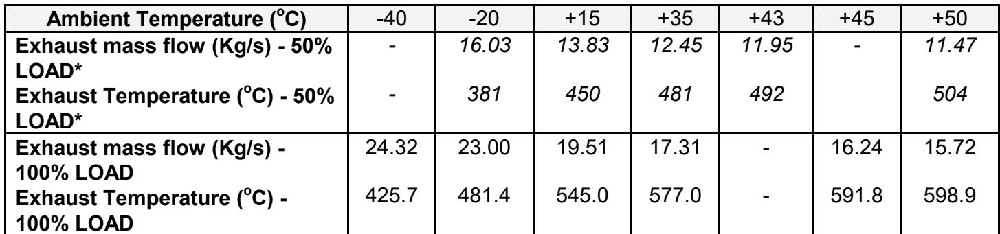
\*based on non uprated engine

# 3.14 Exhaust pressures

a) The max allowable exhaust back pressure for a simple cycle exhaust system is 75mmH2O measured from the exhaust collector flange.   
b) The additional pressure drop across a waste heat recovery system should not exceed 250mmH2O   
c) The pressure drop across a silencer should not exceed 60mmH2O   
d) When an application has even a remote possibility that the exhaust may become blocked (e.g. By-pass

Issue 05   
Page 13 of 49   
Date:12-12-2014

Damper etc) then the exhaust flexible upstream of the potential blockage should be designed to withstand, as a minimum, a pressure of 940mmH2O.

# 3.15 Exhaust life data

These data are for life cycle analysis. Maximum temperatures are indicated in engine flows and temperature section

Data required from core engine

# 3.16 Combustion inlet pressure drop and design pressure

a) The inlet ducting shall be designed for momentary reverse flow of 406 mmH2O. b) The max allowable intake system pressure drop is 100mmH2O in clean condition

# 3.17 Geometric tolerances

a) Tolerances of flanges is as below

Squareness +/- 2.5mm. • Flatness +/- 2.5mm Overall dimensions +/- 3.0mm Parallel on mating faces 3.0mm max. face to face.

b) Tolerances on bolt hole locations should be no greater than the design bolt radial clearance to ensure that the ducts can be connected without the opening out of any holes.

# 3.18 Coordinate system

Siemens standard coordinate system is referenced in EIN 04-11-00